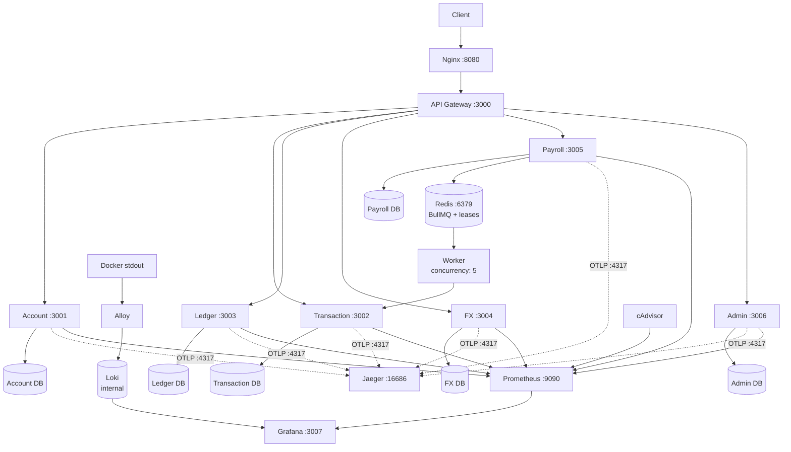

# NovaPay

NovaPay is a transaction-backend assessment project: seven Fastify microservices behind an API gateway implementing idempotent transfers, double-entry ledger accounting with cryptographic audit chaining, FX-quoted international transfers, queued payroll disbursement, and full metrics/logs/traces observability — all runnable locally with Docker Compose.

## Overview

Clients talk to the API gateway (via nginx) which routes to domain services. Each service owns a private PostgreSQL database (no shared DB, no cross-service reads); services coordinate over HTTP with idempotency keys. Redis backs the BullMQ payroll queue and distributed lease locks. Prometheus, Grafana, Loki/Alloy, Jaeger, and cAdvisor provide the observability stack.

## Architecture



No service reads or writes another service's database directly — all cross-service communication is over HTTP, enforced at the infra level by giving each service its own Postgres database (see `scripts/init-multi-db.sh`).

## Key Engineering Features

- **Idempotent transactions** — keyed requests with replay, race, expiry, and payload-mismatch handling (`decisions.md` Problem 1)
- **Double-entry ledger** — balanced debit/credit batches, live invariant check, SHA-256 audit hash chain
- **Crash recovery** — automatic scheduler reconciles stale `PROCESSING` transactions with ownership-safe Redis leases (`docs/HARDENING.md`); money-movement audit in [docs/MONEY_MOVEMENT_CONSISTENCY.md](docs/MONEY_MOVEMENT_CONSISTENCY.md)
- **Payroll concurrency protection** — shared BullMQ queue, per-employer lease locks, parallel cross-employer processing
- **Transaction history** — keyset/cursor pagination over composite wallet indexes, EXPLAIN-verified (`docs/TRANSACTION_HISTORY.md`)
- **Redis coordination** — payroll employer locks and recovery leases (token-owned, Lua release, heartbeat renewal)
- **Observability** — Prometheus metrics, Grafana dashboards, Loki centralized logging, Jaeger distributed tracing (`docs/OBSERVABILITY.md`)
- **Request hardening** — Nginx 10 MB edge cap plus application batch validation (`docs/REQUEST_SIZE_LIMITS.md`)
- **PII protection** — AES-256-GCM envelope encryption, write-only by design (`docs/ENCRYPTION_AND_TESTS.md`)
- **Service-to-service security** — per-service identity tokens with route-scoped authorization, no shared global credential (`docs/SERVICE_TO_SERVICE_SECURITY.md`)

## Services

| Service | Responsibility |
|---|---|
| API Gateway | External API entry point, routing, Swagger UI |
| Account | Wallet/account operations, PII encryption |
| Transaction | Transfer orchestration, idempotency, history |
| Ledger | Double-entry ledger, invariant checks, audit chain |
| FX | Exchange-rate quotes (60s TTL, single-use) |
| Payroll | Queued batch disbursement with checkpoint resume |
| Admin | Administrative operations |

## Assessment Requirement Coverage

| Requirement | Status | Evidence |
|---|---|---|
| Architecture / high-throughput design | Implemented | 7 services, own DBs each; `docs/ARCHITECTURE.md` |
| Problem 1 — idempotency | Implemented | Scenarios A–E in `decisions.md`; replay tests |
| Problem 2 — bulk payroll / per-employer concurrency | Implemented | Shared queue + lease locks; `decisions.md` Problem 2 |
| Problem 3 — FX quote locking | Implemented | Atomic single-use consume; `decisions.md` Problem 3 |
| Problem 4 — field-level encryption | Implemented | AES-256-GCM envelope, write-only; `decisions.md` Problem 4 |
| Observability | Implemented | Prometheus/Grafana/Loki/Alloy/Jaeger; `docs/OBSERVABILITY.md` |
| Ledger invariant alerting | Implemented | `ledger_invariant_violations_total` + Grafana alerts |
| CI/CD | Implemented | 4 workflows, 5 gate jobs; `make check` |
| Transaction history | Implemented | Keyset pagination; `docs/TRANSACTION_HISTORY.md` |
| Crash recovery | Implemented | Scheduler + leases; `docs/HARDENING.md` |
| Service-to-service auth | Implemented | Per-service tokens; `docs/SERVICE_TO_SERVICE_SECURITY.md` |

## Verified Project Metrics

Measured from the repository and live stack; values evolve with the code:

| Metric | Value |
|---|---:|
| Application services | 7 |
| Business API endpoints | 22 |
| Internal endpoints | 1 |
| Test cases | 157 |
| Unit tests | 135 |
| Integration tests | 22 |
| Test files | 43 |
| PostgreSQL databases | 6 |
| Prisma models | 11 |
| CI workflows | 4 |
| CI gate jobs | 5 |
| Observability components | 7 |
| Running containers | 16 |

## Load Testing

Zero-dependency harness at `scripts/load/load-test.mjs` (`make load-test`;
read-only defaults, `WRITE=1` + isolated keys for writes):

| Scenario | Requests | Rate | Errors | p50 | p95 | p99 |
|---|---:|---:|---:|---:|---:|---:|
| Baseline | 600 | 20 rps | 0% | 5 ms | 8.3 ms | 15.1 ms |
| HTTP load | 3,000 | 100 rps | 0% | 4.7 ms | 33.7 ms | 123.8 ms |
| Transfers | 300 | 5 rps | 0% | 267 ms | 721 ms | 1,471 ms |

Transfer validation: 300/300 successful, sender balance exactly 970,000
cents, Prometheus/invariant monitoring healthy throughout. These
measurements represent the tested live-stack configuration and are not
a formal maximum-capacity claim. Full record: [docs/LOAD_TESTING.md](docs/LOAD_TESTING.md).

## Quick Start

```bash
# Full production/assessment stack (builds images)
make up            # start (uses existing images)
make build-up      # force rebuild + start
make down          # stop and remove
make logs          # tail logs
make ps            # container status

# Development stack (live code mounts, no rebuilds)
make dev-up        # start dev stack
make dev-down      # stop dev containers
make dev-logs      # tail dev logs
make dev-ps        # dev container status
```

Full guide (environments, ports, databases, testing, troubleshooting): [docs/SETUP.md](docs/SETUP.md).

For manual API testing, [requests.http](requests.http) provides
ready-made requests (health checks, wallet creation, idempotent
transfers with replay scenarios, FX quotes, ledger invariant check)
for REST-client compatible editors.

## Documentation

### Architecture & Engineering

- [decisions.md](decisions.md) — architecture decision records
- [docs/HARDENING.md](docs/HARDENING.md) — logging, ledger audit batching, auto-recovery
- [docs/OBSERVABILITY.md](docs/OBSERVABILITY.md) — metrics/logs/traces architecture
- [docs/TRANSACTION_HISTORY.md](docs/TRANSACTION_HISTORY.md) — keyset pagination design
- [docs/REQUEST_SIZE_LIMITS.md](docs/REQUEST_SIZE_LIMITS.md) — Nginx vs application limits
- [docs/ENCRYPTION_AND_TESTS.md](docs/ENCRYPTION_AND_TESTS.md) — PII posture and test strategy
- [docs/SERVICE_TO_SERVICE_SECURITY.md](docs/SERVICE_TO_SERVICE_SECURITY.md) — internal identity and authorization
- [docs/RESILIENCE.md](docs/RESILIENCE.md) — timeouts and failure semantics
- [docs/API_SECURITY.md](docs/API_SECURITY.md) — input validation and error hygiene
- [docs/DATABASE_HARDENING.md](docs/DATABASE_HARDENING.md) — constraints, bounded reads, index evidence
- [docs/ARCHITECTURE.md](docs/ARCHITECTURE.md) — system flows and trust boundaries

### Setup & Operations

- [docs/SETUP.md](docs/SETUP.md) — installation, environments, ports, testing, troubleshooting

### API

- [docs/API.md](docs/API.md) — endpoint map, auth, pagination, error conventions
- [docs/LOAD_TESTING.md](docs/LOAD_TESTING.md) — harness, safety rules, measured results
- Swagger UI: [http://localhost:8080/docs](http://localhost:8080/docs) (stack running)
- OpenAPI JSON: [http://localhost:8080/docs/json](http://localhost:8080/docs/json)

## Observability

```
Application → Docker stdout → Alloy → Loki → Grafana (logs, Explore)
Application → OpenTelemetry → Jaeger (traces, :16686)
Application → Prometheus → Grafana (metrics/dashboards, :9090/:3007)
```

Details: [docs/OBSERVABILITY.md](docs/OBSERVABILITY.md).

## Quick Review / Start Here

Suggested 60–120 second path, then deeper as needed:

1. This README (overview, metrics, load results)
2. [docs/ARCHITECTURE.md](docs/ARCHITECTURE.md) (design)
3. [decisions.md](decisions.md) (why these choices)
4. [docs/MONEY_MOVEMENT_CONSISTENCY.md](docs/MONEY_MOVEMENT_CONSISTENCY.md) (correctness core)
5. [docs/OBSERVABILITY.md](docs/OBSERVABILITY.md) (monitoring)
6. [docs/LOAD_TESTING.md](docs/LOAD_TESTING.md) (measured performance)
7. Remaining specialized docs from the index above

## Engineering Evidence

Verifiable in-repo proof (not claims): idempotency scenarios A–E with
replay tests; crash-recovery suites asserting balances, batches, and
statuses; live invariant checks holding delta zero; hash-chain
verification tests; per-employer serialization tests; atomic FX
single-consume tests; Prometheus/Grafana dashboards with alert rules;
Jaeger traces across services; 16-container Docker stacks; gated CI
(`ci-status` required); load runs above with cent-exact reconciliation.

## API Documentation

Endpoint details live in [docs/API.md](docs/API.md) and the OpenAPI spec — browse them at [http://localhost:8080/docs](http://localhost:8080/docs) with the stack running, or fetch [http://localhost:8080/docs/json](http://localhost:8080/docs/json).

## Technology Stack

Fastify + TypeScript (Node 20) · PostgreSQL 16 + Prisma 6 · Redis 7 + BullMQ 5 · Nginx · Prometheus + Grafana + Loki/Alloy · Jaeger/OpenTelemetry · Docker Compose · Vitest · GitHub Actions.

## Testing & Verification

`make check` runs the local gate (typecheck + lint + unit + integration tests). Money-movement, concurrency, crash-recovery, and auth behaviors are additionally proven by integration suites plus live-stack verification each phase (see phase docs above).

## Current Limitations

Single-host assessment stack: shared Postgres role/instance, dev-default service tokens (rotate before any real deployment), no mTLS, no rate limiting, no dead-letter queue, 7-day local log retention. Each limitation is recorded with its rationale in the linked docs above.

## CI/CD

GitHub Actions pipeline (`.github/workflows/ci.yml`): path-filtered per-service matrix (`npm ci` → unit + integration tests → typecheck → coverage/audit → Docker build → version-gate), with `ci-status` as the single required check. Local equivalent: `make check`.

## Tradeoffs Made Under Time Pressure

- Static FX rate table instead of a live provider integration
- Single shared Postgres instance with per-service databases (production would use independent instances)
- No mTLS between services
- No dead-letter queue for payroll items that exhaust BullMQ retries
- PII encryption is write-only by design (no read path requires plaintext)
