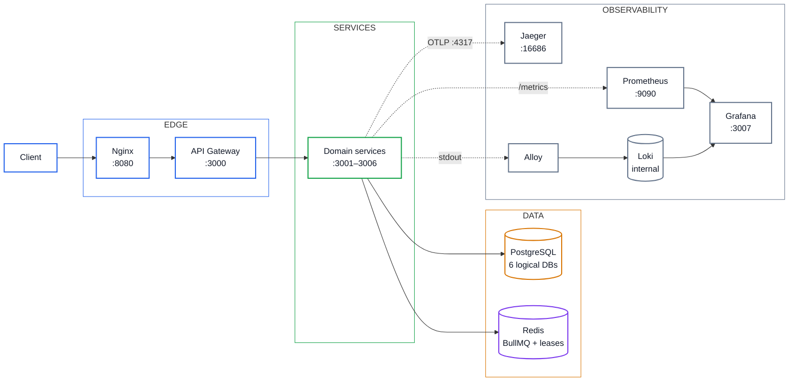

# NovaPay — Architecture

## Service Boundaries

Each service owns one logical PostgreSQL database and exposes HTTP;
no service reads another's tables. The gateway routes by prefix and
injects service identity; it holds no business logic.

## Data Stores

Six logical databases on one Postgres 16 instance for local use
(`scripts/init-multi-db.sh`); Redis 7 serves BullMQ queues and
distributed lease locks (`SET key token NX PX`, Lua-guarded release).

## Flows

- **Transaction:** `POST /transactions` → idempotency gate → debit sender
  → ledger batch → credit recipient → conditional `COMPLETED`; failures
  compensate via idempotent reversal (`REVERSED`).
- **Ledger:** balanced debit/credit batches per transaction, live
  `SUM(debit)==SUM(credit)` invariant plus a SHA-256 audit hash chain.
- **Recovery:** in-process 60s scheduler re-runs stale `PROCESSING` rows
  through the same idempotent `execute()` under a per-transaction lease.
- **Payroll:** shared BullMQ queue, worker `concurrency: 5`, per-employer
  Redis lease for same-employer serialization, checkpoint-index resume.
- **FX:** 60s TTL single-use quotes, atomically consumed.
- **History:** keyset-paginated reads over composite wallet indexes.

## Trust Boundaries

External clients reach only gateway-routed paths. Services authenticate
to each other with per-service bearer tokens and route-scoped
authorization (`docs/SERVICE_TO_SERVICE_SECURITY.md`). `/internal/*`
accepts only the owning service and is never gateway-routed.

## Observability

Metrics (Prometheus), logs (Alloy → Loki), traces (OTel → Jaeger),
all explored from Grafana. Details: `docs/OBSERVABILITY.md`.
