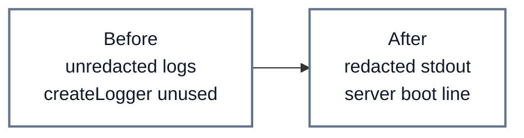
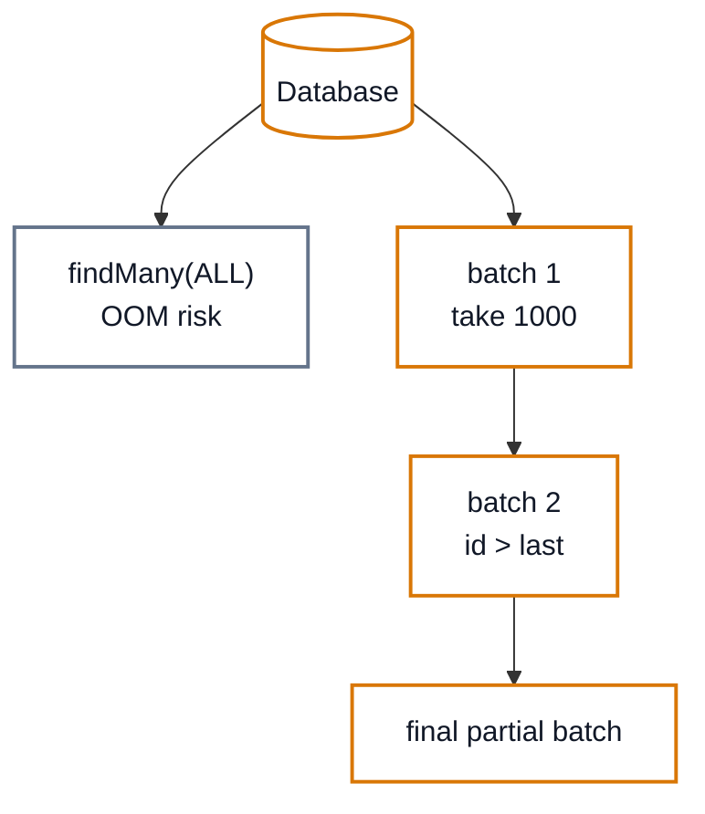
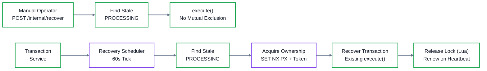

# NovaPay — Hardening Index

Completed engineering fixes, by category. Each item links to the
document with full analysis; this file then details the original
logging/audit/recovery wave below.

**Correctness:** idempotent disbursement (`decisions.md` Problem 1) ·
money-movement consistency incl. concurrency audit
(`docs/MONEY_MOVEMENT_CONSISTENCY.md`) · ledger invariants + batched
audit (below) · crash/auto recovery (below) · keyset history pagination
(`docs/TRANSACTION_HISTORY.md`)

**Reliability:** automatic recovery scheduler · Redis ownership-safe
leases · 15s downstream timeouts, never retried inline
(`docs/RESILIENCE.md`) · bounded scans everywhere
(`docs/DATABASE_HARDENING.md`)

**Security:** S2S bearer identity + route authorization
(`docs/SERVICE_TO_SERVICE_SECURITY.md`) · internal route protection ·
input validation + error sanitization (`docs/API_SECURITY.md`) ·
logging redaction (below) · write-only PII
(`docs/ENCRYPTION_AND_TESTS.md`)

**Performance:** keyset pagination · audit batching · EXPLAIN-verified
indexes · bounded queries (`docs/DATABASE_HARDENING.md`,
`docs/TRANSACTION_HISTORY.md`)

**Observability:** Prometheus/Grafana · Loki/Alloy · Jaeger/OTel
(`docs/OBSERVABILITY.md`)

**Testing:** unit, integration, concurrency, crash-recovery, and live
verification suites run per phase (`make check`).

**Intentionally deferred (not bugs):** mTLS/service mesh · Sentry ·
external alerting · read replicas/partitioning · per-service DB roles
and secret rotation · request rate limiting · object-storage payroll
uploads. Each is documented as future work in its respective doc.

---

# Hardening Phase (Logging, Ledger Scans, Auto-Recovery)

## Problem

Three confirmed review findings, each fixed minimally:

1. **Dead logger utility** — every service shipped an identical
   `lib/logger.ts` (`createLogger`, secret redaction paths) that nothing
   imported. Fastify bootstraps ran with bare `logger: true` /
   `logger: { level }`, so access and error logs had **no
   secret/PII redaction**.
2. **Unbounded ledger audit scan** — `auditVerify()` loaded the entire
   `ledger_entries` table into memory (`findMany`, no bound).
3. **Manual-only crash recovery** — `POST /internal/recover` re-ran stale
   `PROCESSING` transactions, but nothing ever called it automatically.

(`invariantCheck()` was audited and left alone: it is already a single
`GROUP BY` aggregate returning one row per currency — bounded by design.)

## Definitions

- **Structured logging** — JSON log lines with level, module, request ID,
  and automatic redaction of secret-shaped fields.
- **Bounded/batched scan** — iterating a table in fixed-size keyset pages
  instead of one unbounded read.
- **Stale transaction** — `status = PROCESSING` with `processingStartedAt`
  older than 60s (crashed mid-`execute`, never completed).
- **Recovery worker/scheduler** — in-process 60s interval inside
  transaction-service that finds stale rows and re-runs `execute()`.
- **Idempotent recovery** — re-running `execute()` on an already-finished
  row returns the stored result without moving money twice (status
  re-check + conditional `updateMany … WHERE status='PROCESSING'` +
  downstream idempotency keys).
- **Distributed lock** — Redis `SET key token NX PX ttl` lease; only the
  token holder may release/renew (atomic Lua compare), so an expired
  holder can never steal a successor's lock.

## Architecture

Logger wiring (all 7 services, before → after):

Ledger audit (before → after):

Transaction recovery (before → after):

## Why the Previous Implementation Was Insufficient

- **Logging:** a redaction list nobody loads is not a control. Any request
  body echoed into an error log (validation failures log `error` objects
  that can carry bodies) could persist PII/secrets.
- **Audit:** `findMany` without bound loads every entry (BigInt amounts,
  hashes) into one array — memory grows with ledger age; one slow query
  holds a snapshot for the whole table.
- **Recovery:** crash-orphaned `PROCESSING` rows sat until a human called
  the endpoint; two concurrent callers (or two replicas) both scanned the
  same stale set with no mutual exclusion.

## Design

- **Logging:** `app.ts` passes the existing `REDACT_PATHS` into Fastify's
  own logger options — same single stdout stream (no duplicate logs, no
  container file growth), now redacting passwords, tokens, KEKs, and
  wrapped DEKs. `server.ts` emits one `createLogger("server")` boot line.
  No new library (pino, already present); request IDs still flow via the
  `x-request-id` plugin + ALS context.
- **Audit:** `auditVerify(batchSize = 1000)` pages by monotonic BigInt `id`
  (`WHERE id > lastId ORDER BY id ASC TAKE n`), carrying the hash-chain
  state across batches. Identical return shape (`{ok, records}` /
  `{ok:false, failedAt}` with the same global 1-based index).
- **Recovery:** `recoverStaleTransactions()` (shared by the scheduler and
  the existing `/internal/recover` route, which now delegates to it):
  stale-only scan → per-row `SET NX PX 300s` lease → `execute()` →
  release in `finally`. A 60s heartbeat renews the lease (Lua
  compare-and-expire) because `execute()` performs unbounded downstream
  HTTP with no client timeouts — a fixed TTL alone would be unsafe.
  Contended rows are skipped, never double-run. Scheduler ticks every
  60s (5s startup delay so restarts promptly recover), skips while a tick
  is in flight, survives tick failures, and stops cleanly on
  SIGTERM/SIGINT. New `REDIS_URL` env on transaction-service (both
  compose files, `.env.example`); `ioredis@^5.4.1` added (same range as
  payroll-service).

## Correctness

- **No skipped rows:** keyset pagination is monotonic on the append-mostly
  `id` sequence; each page starts strictly after the previous page's last
  id, and the loop ends only on an empty/short page. New rows appended
  mid-audit sort after the cursor and are picked up by the next run.
- **No double-process:** the lease guarantees at most one executor per
  transaction at a time; `execute()` itself re-checks status and uses
  conditional writes plus downstream idempotency keys, so even a
  scan-then-complete race resolves to a safe no-op replay.

## Failure Scenarios

- **Worker crash:** Redis TTL (300s, renewed while alive) frees the lease;
  next tick re-runs; `execute()` resumes idempotently.
- **Redis lock expiry mid-run:** heartbeat renews every 60s; if renewal
  fails repeatedly the lease lapses and a peer may start — `execute()`'s
  guards still prevent double money movement.
- **Database failure:** the tick/scan throws, the lock releases via
  `finally`, the scheduler logs and retries next tick; the HTTP route
  returns 500 as before.
- **Service restart:** first tick 5s after boot recovers pre-crash orphans.
- **Duplicate recovery attempt:** second holder finds the lease held and
  skips the row; repeated full runs converge to zero stale rows.

## Testing

- `test/logger.test.ts` (account): redaction-path contract + logger shape.
- `test/audit-verify.test.ts` (ledger, mocked table honoring cursor/take):
  multi-batch full coverage, empty set, mid-table tamper with global
  `failedAt`, final-partial-batch tamper, cross-boundary chain break.
- `test/recovery.test.ts` (transaction, fake Redis + stub execute):
  stale recovered once, query cutoff shape, fresh untouched, failure
  releases + propagates, contender skips while peer proceeds, expired
  lock proceeds, heartbeat holds across TTL windows, repeat converges,
  scheduler boot-recovery + stop.
- Existing suites re-run: all 7 unit suites green; ledger (4/4) and
  transaction (6/6) integration suites green against local PG/Redis.

## Tradeoffs

- `SET NX` + Lua renewal is hand-rolled Redlock-lite, not Redlock: single
  Redis instance is a SPOF for liveness only (safety holds regardless).
- 60s poll + 60s staleness bound worst-case ~2min recovery latency — fine
  for crash orphans, not a realtime guarantee.
- File-stream destinations in `logger.ts` remain unused by design (stdout
  in containers); the module is now imported, so empty `.logger/`
  directories may appear — covered by `*.log` gitignore, no tracked churn.
