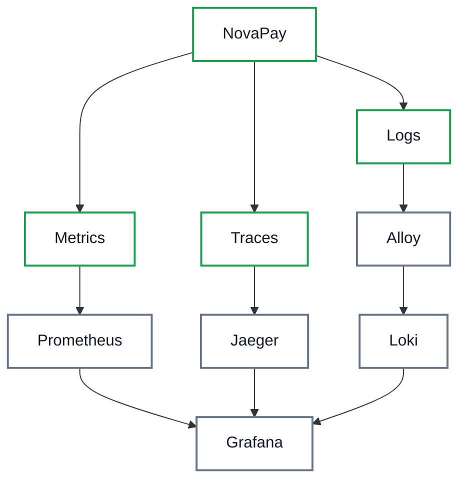

# NovaPay — Observability Architecture

## Goals

One place to answer "what happened": metrics show *how much/how slow*,
traces show *where time went across services*, and centralized logs show
*what each service said*. Before this phase, logs lived only in per-
container stdout (and `docker logs`); Loki + Alloy make them queryable
next to metrics and traces in Grafana.

## Current Stack

OpenTelemetry (traces → Jaeger), Prometheus (metrics), Grafana
(dashboards + Explore), Jaeger (trace viewer), cAdvisor (container
metrics), **Loki (log storage)** and **Grafana Alloy (log collection)**.
Pino/`createLogger()` remains the only logging library.

## Signals

- **Metrics** (Prometheus, 5s scrape): request latencies, throughput,
  ledger invariant violations, payroll queue depth, FX failures.
- **Traces** (OTel → Jaeger `:4317`): per-request spans across the
  gateway and all services.
- **Logs** (Pino stdout → Alloy → Loki): structured JSON application
  logs plus container stdout/stderr, queryable in Grafana.

## Architecture



## Logging Flow

```mermaid
flowchart LR
    Pino["Fastify / Pino<br/><small>Structured JSON logs</small>"]
    Docker["Docker<br/><small>stdout / stderr</small>"]
    Alloy["Grafana Alloy<br/><small>Log collection & forwarding</small>"]
    Loki["Loki<br/><small>TSDB · 7-day retention</small>"]
    Grafana["Grafana<br/><small>Log visualization</small>"]

    Pino -->|JSON logs| Docker
    Docker -->|stdout / stderr| Alloy
    Alloy -->|HTTP :3100<br/>project-scoped| Loki
    Loki -->|Log queries| Grafana

    classDef service fill:#ffffff,stroke:#16a34a,stroke-width:2px,color:#111827
    classDef observability fill:#ffffff,stroke:#64748b,stroke-width:2px,color:#111827

    class Pino service
    class Docker,Alloy,Loki,Grafana observability

    linkStyle default stroke:#64748b,stroke-width:2px
```



## Label Strategy

Only low-cardinality stable fields become Loki labels:

| Label | Source |
|---|---|
| `service` | compose service name (`api-gateway`, `transaction-service`, …) |
| `container` | Docker container name |
| `environment` | static `novapay` |

`level`, `msg`, `requestId`, `trace_id`, `span_id`, `error`, and all
other structured fields stay **inside the JSON log line** and are
filtered at query time (`| json`). Parsing them into labels at ingestion
would drop non-JSON lines (startup banners, framework notices) and risk
cardinality explosion. (Loki itself derives two extra low-cardinality
stream labels, `detected_level` and `service_name` — those come from the
server, not this pipeline.) Useful queries:

```logql
{service="transaction-service"} | json | level >= 50
{service="payroll-service"} | json | trace_id = "abc…"
{service="api-gateway"} | json | requestId = "req-…"
```

## Trace/Log Correlation

`createLogger()` attaches `trace_id`/`span_id` from the active OTel span
(read-only `@opentelemetry/api` use; omitted when no valid span is
active — never invented). `requestId` comes from the existing ALS
request context (`x-request-id`). Correlation paths:

- log → trace: `trace_id` in any contextual log opens directly in Jaeger.
- log → log: `requestId` joins gateway + downstream service logs.
- Note: Fastify access logs carry `requestId` but not `trace_id`
  (no per-request span exists at access-log time) — use a contextual
  log line for trace joins. No OTel Logs API migration was needed.

## Security

- Fastify bootstraps load the existing `REDACT_PATHS` (passwords, tokens,
  KEKs, wrapped DEKs, PII-shaped keys) — verified by unit tests; never
  log secrets, JWTs, API keys, encryption keys, or full financial data.
- Loki listens only on the Docker network (`http://loki:3100`, no host
  port); Grafana reaches it via Docker DNS.
- Alloy mounts `/var/run/docker.sock` **read-only** for container
  discovery/log collection, runs unprivileged, and scrapes only its own
  compose project (`ALLOY_PROJECT`), so parallel stacks never duplicate
  each other's logs.

## Failure Modes

- **Loki down:** Alloy retries with backoff (WAL-buffered); applications
  keep serving — logging is fire-and-forget stdout, never a dependency.
- **Alloy down:** containers keep logging to Docker's json-file driver;
  on restart Alloy resumes from last position; the gap stays queryable
  via `docker logs`.
- **Grafana down:** collection and storage continue; Explore recovers
  automatically when Grafana returns.
- **Application availability never depends on Loki.**
- **Dev-only log transport in prod images:** `pino-pretty` is a
  devDependency removed by production pruning, so `lib/logger.ts` loads
  it defensively (try/catch, stdout fallback). Never import a dev-only
  transport unconditionally at module top level — a throw there crashes
  the container before Fastify boots (observed: all 7 services exiting 1
  with `unable to determine transport target for "pino-pretty"`).

## Local Development

```bash
# Tail one service the old way
docker compose -f infra/docker-compose.yml logs -f transaction-service
# Query centralized logs (Grafana → Explore → Loki datasource)
# e.g. {service="transaction-service"} | json | level >= 50
```

## Future Improvements

- Grafana internal alerting on log patterns (no external notifications —
  deliberately deferred, as with metrics alerts).
- Sentry only if dedicated error tracking becomes necessary.
- Longer retention / object-store backend for production Loki.
- Authentication on externally exposed Grafana; Loki stays internal.
