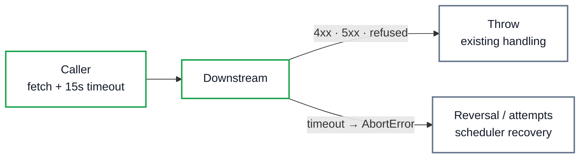

# NovaPay — Resilience & Timeout Semantics

## Problem

No service-to-service HTTP call had any timeout: a hung downstream meant
a hung worker, hung transfer, or hung payroll item — forever. Fetch
without `AbortSignal` waits indefinitely.

## Why It Matters

An unbounded wait converts a downstream slowness incident into a
platform-wide stall (exhausted worker slots, stuck `PROCESSING` rows,
wedged payroll batches). Timeouts bound the blast radius; the existing
recovery machinery then finishes the job safely.

## Architecture

No automatic retries anywhere in the HTTP layer.

## Definitions

- **Timeout**: maximum wait per downstream call (`HTTP_TIMEOUT_MS`).
- **Retryable**: only paths with proven idempotency (BullMQ attempts,
  scheduler re-execution, idempotent op keys).
- **Ambiguous execution**: a timeout after the downstream may have
  applied the mutation — handled by recovery, never by blind retry.

## Current Implementation

- `transaction-service/src/lib/http.ts`: `post`/`get` accept an optional
  per-call override, default `HTTP_TIMEOUT_MS = 15_000`.
- `payroll-service` item transfers and `admin-service` ledger reads use
  the same 15s bound inline.
- Gateway proxy and Fastify servers intentionally have no global
  timeout: amputating a proxied transfer mid-flight is worse than a
  slow one.

## Failure Behavior

| Failure | Handling |
|---|---|
| 4xx | Throws with `status`/`code`; no retry (rejected before execution) |
| 5xx | Throws; caller compensates (reversal) or retries idempotently |
| Connection refused | Throws immediately (fail fast) |
| Timeout | `AbortError`; ambiguous outcome → existing recovery paths |
| Lost response | Same as timeout: never assumed unexecuted |

The financial rule is absolute: a timed-out debit/credit/ledger call is
*never* retried inline. Debit timeouts resolve via the next recovery
tick (idempotent replay); ledger timeouts resolve via reversal +
`REVERSED` (a committed-but-unconfirmed batch stays as a balanced
record of an aborted attempt — see `docs/MONEY_MOVEMENT_CONSISTENCY.md`).

## Security Considerations

Timeouts also bound resource exhaustion from slowloze-style abuse:
no connection is held longer than 15s per downstream hop.

## Testing

`test/http.test.ts` (mock downstream): 4xx/5xx shape, connection
refusal, and hung-endpoint abort — plus proof of no silent retry.
Existing crash-recovery suites prove the compensation paths the
timeouts feed into.

## Tradeoffs

- 15s is generous for same-host Docker calls (p99 is milliseconds);
  chosen so legitimate money movement is never amputated.
- No per-endpoint tuning yet; one constant keeps behavior predictable.

## Limitations

- No client-side timeouts would help a downstream that accepts the
  connection but trickles bytes forever *under* 15s of activity —
  mitigate with server-side safeguards if ever observed.
- Gateway/servers rely on downstream bounds; a future global cap would
  need per-route exemptions for long-polling-style endpoints.
