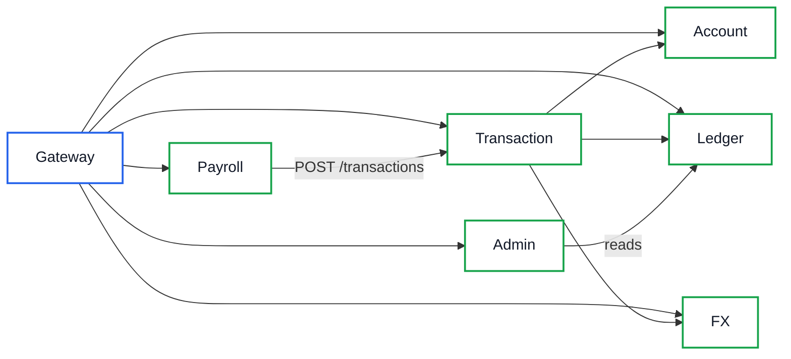

# NovaPay — Service-to-Service Security

## Problem

All internal HTTP endpoints accepted any caller on the Docker network:
no service identity, no credentials, no per-endpoint authorization.
Any container (or a compromised service) could post ledger batches,
invoke wallet operations, consume FX quotes, or trigger recovery —
and impersonate any other service without detection.

## Threat Model

| Path | Before | After |
|---|---|---|
| External client via gateway | Public routes reachable (by design); `/internal/recover` unreachable (no matching prefix → 404) | Unchanged, gateway now authenticates downstream as `api-gateway` |
| Direct container-to-container | **Everything callable, no auth** | Callers need a trusted identity + route-scoped authorization (verified live: 401 unauthenticated / wrong token, 200 with owner token) |
| Host network | App services expose no host ports; only via gateway/nginx | Unchanged |
| Compromised service | Can impersonate anyone, call anything | Limited to its own identity's allow-list |

## Architecture

## Service Identity

Each service sends `x-service-id` (its name, e.g. `transaction-service`)
identifying itself. The gateway **overwrites** these headers on proxied
requests, so external clients cannot spoof a service identity through it.

## Authentication

Each service holds a unique `SERVICE_TOKEN`. Receivers verify
`x-service-token` against per-peer secrets (`PEER_<NAME>_TOKEN`) with
constant-time comparison. Missing, unknown, or wrong credentials all
return the same `401 UNAUTHORIZED` — never revealing which half failed.
No universal credential exists; every service has its own token.

## Authorization

Authentication answers *who*; per-route allow-lists answer *may it*:

| Receiver | Identity | Allowed |
|---|---|---|
| account | transaction-service, api-gateway | all routes |
| ledger | transaction-service | `POST /batches`, `GET /batches*` |
| ledger | admin-service | `GET /invariant-check`, `GET /audit/verify` |
| ledger | api-gateway | `GET /*` (reads only — external batch forgery closed) |
| transaction | api-gateway | `POST /transactions`, `/transfers*`, `/international*`, `GET /transactions*` |
| transaction | payroll-service | `POST /transactions` only |
| transaction | transaction-service (self) | `POST /internal/*` only |
| fx | api-gateway | `POST /quote`, `GET /quote*` |
| fx | transaction-service | `POST /quote/*` (consume only) |
| payroll, admin | api-gateway | all routes |

Anything else → `403 FORBIDDEN`. `/health` and `/metrics` stay open
(scraping/healthchecks carry no identity).

## Internal Endpoint Protection

`POST /internal/recover` accepts only the transaction-service identity
(self/operator). Through the gateway it is denied even under a lookalike
path: the service auth hook rejects before routing, so external clients
get `403` (verified live), never execution. Scheduler recovery is
in-process and never touches HTTP.

## Credential Management

- Dev defaults (`novapay-dev-<service>-token`) live in compose files and
  `.env.example` placeholders, following the existing
  `FIELD_ENCRYPTION_KEK` dev-secret precedent — **rotate before any
  non-local deployment**.
- Real secrets never appear in source, logs (`x-service-token` is in
  `REDACT_PATHS`), or API responses (401/403 bodies carry no details).
- Peer tokens are read per request, so rotation needs no restart.

## Request Context

Unchanged: `x-request-id` still flows end-to-end (ALS context), user
identity (`userId`) stays in request context, never in auth headers.
Service identity and user identity are separate concepts end to end.

## Failure Behavior

| Condition | Result |
|---|---|
| Missing/invalid/unknown credential | 401, generic body |
| Valid identity, disallowed route | 403, generic body |
| Receiver misconfigured (no peer token) | Fail closed (empty token never matches) |
| Service unavailable | Caller's existing retry/error path (unchanged) |

## Testing

Unit (per-service rule matrices), integration (real middleware +
handlers + mocks): unauthenticated/unknown/invalid → 401,
cross-scope → 403, gateway flows pass, `/internal/recover` unreachable
via gateway path, requestId echo preserved, tokens absent from bodies.

## Operational Notes

- Verify with live traffic (see validation log in phase report).
- Prometheus scrapes `/metrics` without credentials (public by design).
- After rotating a token, update that service's `SERVICE_TOKEN` and every
  trusting receiver's `PEER_*` entry.

## Limitations

- Bearer tokens on a trusted network, not mTLS: no protection against
  an attacker who can read another service's environment. Chosen
  deliberately — mTLS/service mesh is unjustified for this
  single-host assessment stack.
- No token expiry/rotation automation; rotation is manual.
- User-facing authorization (end users) does not exist in NovaPay and is
  out of scope; this phase covers service identity only.
